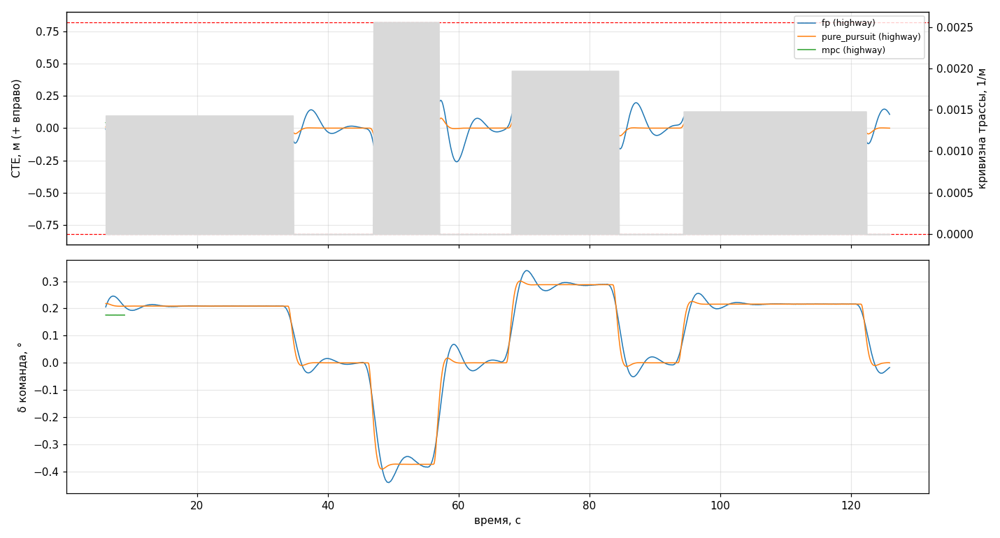

# Controller run on a track in the simulator

Closed loop: real C++ `LaneKeepService` (via `pyadas`) steers a car in MetaDrive on a
generated track; evaluation uses ground truth: distance from lane center, separately on straights
and on arcs of known radius. Metric idea matches the control test in
[AAD](https://github.com/thomasfermi/Algorithms-for-Automated-Driving) (distance to reference
line), but on physics and map already used in the project.

The controller reads `assets/config.json`, so the run checks what would ship in the APK.

```bash
cd app/src/main/scripts

python3 -m sim.eval --list-tracks
python3 -m sim.eval --track highway --controllers fp
python3 -m sim.eval --track curvy --controllers fp,pure_pursuit --plot out.png
python3 -m sim.eval --track tight --controllers fp --report-only
```

Non-zero exit if the controller misses track thresholds — suitable as a
regression test. `--report-only` prints the report only.

## Tracks

MetaDrive PG generator builds a map from blocks (`S` straight, `C` arc) with random geometry.
Stock radius range — 25–60 m, city turns not highway arcs the assistant was built for. `sim/track.py` fixes the range so runs reproduce for
(track, seed) pair and radii are known upfront, not measured after.

| track | blocks | R, m | v, m/s | a_lat, m/s² | about |
|---|---|---|---|---|---|
| `highway` | `CSCSCSC` | 250–700 | 25 | 0.9–2.5 | working region per `CONTROLLER_LIMITS.md` |
| `curvy` | `CCSCCSCC` | 120–260 | 22 | 1.9–4.0 | torque-limit boundary |
| `tight` | `CSCCSC` | 45–110 | 13 | 1.5–3.8 | deliberately beyond limits, expect departures |
| `straight` | `SSSS` | — | 25 | 0 | baseline for yaw and command jitter |

Arc starts at full curvature immediately, no transition spiral — harsher than real road, and
intentional: curvature step exposes loop delay.

## What is measured

* **CTE** — `lane.local_coordinates(position)`, sign right+, same as C++ `cte_m`.
* **departure %** — fraction of frames where wheel is past line (lane 3.5 m, car 1.86 m → 0.82 m from center).
* **saturation %** — fraction of frames where command hit active steering clamp.
* **HF** — median |Δδ| between steps, command jitter.
* **CTE estimate convergence** — |controller estimate − truth|. With perfect perception should
  be near zero; otherwise simulator feeds controller one world and evaluates in another.

Control step — 90 ms (9 × 10 ms physics), median vision period on phone. Planner measures
period from message timestamps, so it sees the same decision rate as on road.

## Perception: latency and noise

By default the anchor is not ideal but what the controller sees on the car:

| parameter | value | source |
|---|---|---|
| `--vision-latency-ms` | 90 | median capture→path on phone (`PIPELINE_AUDIT_0801.md`) |
| `--vision-noise-m` | 0.15 | path estimate spread between frames at 20 m from runs 07-26 (0.10–0.15 m at 20 m, 0.21–0.23 m at 40 m); noise grows with distance |
| `--vision-jump-hz` / `--vision-jump-m` | 0 / 1.6 | plan jumps on model hypothesis change: p95 \|Δy\| ≈ 1.6 m at 20 m, rate ~0.5 Hz. **Off by default** — see below |

`--vision-latency-ms 0 --vision-noise-m 0` restores perfect perception.

Measured spread includes real vehicle motion between frames, so it is an upper
bound on noise, not pure noise.

### What could not be achieved

Latency and noise expose yaw mechanism: Pure Pursuit command jitter grows from
0.00 to 0.12 °/step. But **simulator still does not reproduce controller ranking**: PP holds lane
better than `fp` (0.03 vs 0.23 m median in arcs) at any tried level, though on road
`fp` became default because of PP yawing. With plan jumps enabled it gets worse —
`fp` breaks (0.27 m on straights, threshold fail), PP barely notices: its
8–20 m lookahead averages the spike, MPC reacts to near field.

Practical conclusion: **this run cannot choose between controllers**. It works as
regression on a fixed controller and as control-law check on known geometry.
Controller choice is decided on recordings and on road.

Thresholds (`straight` / `arc R≥200`: median 0.20 / 0.30 m, p95 0.50 / 0.70 m) come from what the
car does on road — `CONTROLLER_LIMITS.md`. Arcs shorter than 100 m are measured only: documented as outside applicability.

## Vehicle model: why kinematics by default

Our κ→δ conversion uses Golf *measured* under-steer model: at 22 m/s car gives 0.61 of
kinematic curvature. MetaDrive car is different. `sim.vehicle_calib` measures its under-steer on
steady arc segments (curvature on arc radius R equals 1/R, steering angle known):

```
   v, m/s    R, m    δ, °     κ fact    κ kinem   κ/κ_kin
     11.5     243    0.57    0.00412    0.00406      1.01
     11.5     260    0.54    0.00385    0.00381      1.01
     11.5     242    0.60    0.00414    0.00421      0.98
     17.5     243    0.59    0.00412    0.00419      0.98
```

Simulator car is nearly kinematic (0.98–1.01 vs 0.61 for Golf). With Golf under-steer compensation
command in simulator is ~1.6× high, and car runs the arc with stable inward offset: on `highway` was 0.36–0.63 m median. That is a property of a *different
vehicle*, not a controller defect, so runs default to kinematics;
`--vehicle-model` restores model from config.json.

Golf under-steer model is verified on recordings (`PIPELINE_AUDIT_0801.md`), not here.

## Results (2026-08-02, seed 7, vision 90 ms / noise 0.15 m)

`highway`, 3.0 km / 126 s:

| controller | segment | sec | R, m | \|CTE\| med | p95 | max | depart % | HF ° | LDW |
|---|---|---|---|---|---|---|---|---|---|
| `fp` | straight | 39 | — | 0.08 | 0.20 | 0.34 | 0 | 0.03 | 0 |
| `fp` | arc | 77 | 508–699 | 0.08 | 0.23 | 0.34 | 0 | 0.02 | |
| `fp` | arc | 11 | 391 | 0.15 | 0.32 | 0.33 | 0 | 0.03 | |
| `pp` | straight | 39 | — | 0.04 | 0.10 | 0.17 | 0 | 0.11 | 0 |
| `pp` | arc | 77 | 508–699 | 0.04 | 0.11 | 0.19 | 0 | 0.11 | |

`curvy`, 2.4 km / 112 s: `fp` — straights 0.15 / p95 0.47, arcs R 200–260 **0.25 / p95 0.42**;
`pp` — 0.03 / p95 0.08–0.09 with command jitter 0.12 °/step vs 0.03 for `fp`. Threshold passed
by both.

`tight` (outside applicability): `fp` — at R 110 median **0.62** m, at R 65 — 0.48, by 39th
second **leaves the road**. Exactly what `CONTROLLER_LIMITS.md` says about arcs shorter than
100 m.

`mpc` with old config.json left the road in 9 s; feedback gains restored in
config (see below), with them the run passes.

Return to center from 1.1 m offset at 25 m/s (`--offset 1.1`): `fp` returns to 0.02 m median,
`pp` — to 0.00; LDW fires for both (see `SAFETY_WARN.md`).



Plot shows `fp` behavior on curvature step: spike to ±0.2 m on arc entry and exit,
then recovery. `pp` with perfect perception barely errs.

## What this run does NOT prove

* **This tests the control law, not the system.** Anchor is ideal centerline from map: no model
  noise, no 88 ms vision delay, no calibration errors. On road those cause Pure Pursuit yawing,
  which made `fp` the default. PP's ideal simulator result directly
  contradicts its behavior on recordings — and that is expected.
* **Absolute numbers are not comparable to road** (0.16 m median on highway): different car, different
  grip, different anchor.
* What is comparable — *relative* behavior on curvature step, return-to-center speed,
  steering saturation, and command jitter.

## Watch the same run visually

`sim.main` — same thing with a window: same tracks (`--track`), same 90 ms control step, same
map anchor and same `config.json`. One difference: metrics are not split by segment, only run
median is printed.

```bash
./scripts/run_sim.sh --track curvy --controller fp --show        # camera window + overlay
./scripts/run_sim.sh --track straight --offset 1.1 --show        # lane departure and return
./scripts/run_sim.sh --track curvy --lanes supercombo --show     # what model sees on image
```

Without `--show` only MetaDrive 3D window opens, `--no-render` removes it too (how server
runs work).

### Perception in simulator does not work as anchor

`--lanes supercombo` feeds model plan from simulator image into the loop. Checked on `curvy`,
`fp`: on straights model still holds (|CTE| ~0.11 m, line probs 0.23/0.54/0.96), in first
arc probs drop to 0.03–0.13, plan collapses and car leaves lane (|CTE| up to 54 m).
supercombo trained on real camera, MetaDrive render is a different domain.

Therefore:

* closed loop runs only on `--lanes gt` — control-law test;
* `--lanes supercombo` useful to visually inspect model output parsing and overlay;
* full pipeline test is on recordings (`bag_controller_ab.py`, `bag_config_sweep.py`), not in
  simulator.

## Bag replay run: fixes 2026-08-03

`bag_config_sweep.py` — closed loop on a bag window: recorded lane markings reprojected into
simulated car frame, fed to live C++ controller, its angle integrated by `LateralPlant`.
Three fixes without which runs could not be trusted:

* **pose resync no longer replaces lateral position.** Previously every 20 s the car was placed in
  recorded pose entirely — exactly where the driver was, zeroing controller-accumulated
  offset; metric median after that included transient, and offset was partly measured
  relative to driver's line. Now only along-road drift and absolute heading drift reset,
  lateral offset and heading error preserved. Old behavior — `--resync-full`;
* **`core/path_fusion.py` aligned with C++**: it had no σ weight at all, width
  checked with sign (C++ long used absolute) and bounds were old. Runs tested not the code
  that drives;
* **`--cam-y-left` is now required** and must match the bag: previously camera position was
  hardcoded 0.10, and on a run with on-axis camera all numbers shifted 10 cm.

Config sets: `--set default` (straight tuning history), `--set arcs` (levers against
inside cut in arcs), `--set core` (short set to verify methodology).

Two things the run cannot show in principle: lane markings in it are model estimate, not truth, so
systematic perception error is invisible (controller and metric see the same paint); and replay
does not reshoot — when diverging from recorded trajectory, far polyline points come from a viewpoint
that did not observe them.

Open loop (compare controller command to driver steering) does not answer **offset**:
it measures command agreement; offset is integral of command, and steady error is invisible there.

Until 2026-08-02 this was unnoticed: anchor-selection branch was enabled only for `pure_pursuit`, and
`fp` with `--lanes supercombo` silently ran on ground truth.

## Found and fixed: `mpc` did not hold lane with old config.json

With old settings (`mpc_epsi_gain=0`, `mpc_cte_gain_base=0`, `mpc_cte_gain_floor=0`) VisionPilot MPC seed was
pure feedforward: no feedback on offset or heading. In closed loop controller left the road in 9 seconds though selected in the parameter panel.

July tuning gains (`epsi 0.3`, `cte_gain_base 0.6`, `cte_gain_floor 0.02`) restored in
`config.json` 2026-08-02 — with them same run gives 0.01–0.02 m median. `cte_gain_floor`
also fixes loss of offset authority at speed (0.6/(1+v²) vanishes by 16 m/s).
Not verified on road — phone runs `fp`.
