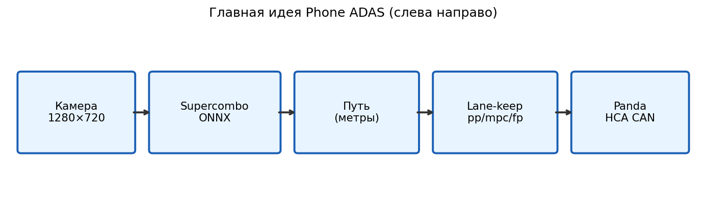

# От кадра до CAN



Инженерная версия с деталями реализации: `docs/IMAGE_TO_CAN_PIPELINE.md`.

## Проследите один кадр, с часами

Этапы ниже держать в голове проще, если смотреть, как через них движется один кадр. Каждое число — измеренная
медиана с ночного заезда длиной 28 минут. Медианы по этапам не обязаны складываться в накопленные медианы —
эти подобраны так, чтобы попасть в две накопленные величины, которые `latency.py` реально печатает: 54 мс до
выхода модели и **79 мс до команды**, — чтобы арифметику можно было проверить, а не принять на слово.

```python
# Measured medians, run 2026_08_06_00_36_42. "own" is the stage's own cost; the clock accumulates.
STAGES = (
    ("capture (Camera2 YUV, capture_ts stamped)", 0.0),
    ("delivery to VisionPipeline", 0.0),          # instrumented from 2026-08; was invisible before
    ("geometric warp to 512x256", 7.0),
    ("Supercombo inference (OrtSession.run)", 45.6),
    ("parse heads -> vision/lanes", 1.0),
    ("Java -> ZMQ -> ZmqBridgeService", 5.0),      # of which ~5 is the 10 ms ingress poll
    ("TopicConvert -> vision/path", 1.0),
    ("LaneKeepService -> controls/steer", 19.4),
    ("PandaService -> HCA_01 on the wire", 10.0),  # its own 10 ms TX timer
)

clock = 0.0
print(f"{'stage':>44} {'own':>6} {'clock':>7} {'car has moved':>15}")
for name, own in STAGES:
    clock += own
    print(f"{name:>44} {own:>5.1f} {clock:>6.1f} {22.0 * clock * 1e-3:>13.2f} m")
print(f"\nAt 22 m/s the command that reaches the rack was computed for a road position {22.0 * clock * 1e-3:.2f} m back.")
print("That is what fp_steer_delay_s compensates, and why it is a feedforward input rather than a nicety.")
```

Две строки в этом списке заслуживают внимания.

**Доставка равна нулю, потому что она была невидима.** До августа 2026 самой ранней меткой времени на кадре
была `capture_ts_ms`, поэтому кадр, пришедший на 40 мс позже, и кадр, простоявший 40 мс в ожидании занятого
потока инференса, выглядели одинаково. `submit_ts_ms`, `pickup_ts_ms` и `frames_dropped` теперь их разделяют
— см. [задержки](../Latency/Overview.md).

**Переход через ZMQ стоит примерно половину интервала опроса.** Это одно из двух мест во всей цепочке, где
вообще есть опрос, второе — выход на CAN. Всё между ними работает по извещению, а не по опросу; измерение в
главе [Middleware](./Middleware.md).

## Что происходит между кадрами

Зрение идёт на 13.24 Гц. Актуатор — на 100 Гц, потому что HCA нужен строгий такт, иначе EPS отбрасывает
команду. Значит примерно семь тиков из восьми панда передаёт команду, построенную на *эталоне, который уже
использовался*.

Это правильное поведение, и оно создаёт ловушку для того, кто читает логи:

```python
VISION_HZ = 13.24
TX_HZ = 100.0
FRESH_WINDOW_MS = 50.0        # latency.py keeps commands within this of their vision timestamp

vision_period_ms = 1000.0 / VISION_HZ
per_frame = TX_HZ / VISION_HZ
print(f"vision period {vision_period_ms:.1f} ms, {per_frame:.1f} actuator ticks per vision frame")
print(f"only the first tick uses a brand-new reference; the rest reuse it")
print()
# The freshness filter is a time window, not "one tick per frame" — so what it keeps is the fraction of
# the vision period that falls inside the window.
kept_predicted = min(1.0, FRESH_WINDOW_MS / vision_period_ms)
print(f"predicted share passing a {FRESH_WINDOW_MS:.0f} ms freshness filter: {100 * kept_predicted:.0f} %")
print(f"measured on the run: 113 723 kept of 168 107 = {100 * 113723 / 168107:.0f} %")
print()
print("Compute e2e latency over the raw stream instead and the republishes drag the number up, because")
print("their vision_ts is older than the command that carries it.")
```

Быстрый контур — не пустая работа: это угловой PID, замыкающийся на *измеренный* угол руля 100 раз в секунду,
и именно он делает движение рейки плавным. Но из этого следует, что «команда свежая» и «картинка свежая» —
разные утверждения, и для безопасности важно только второе. Ровно поэтому гейт устаревания привязан к метке
съёмки кадра, а не к возрасту команды, и поэтому таймаут команды HCA в 250 мс не защитил от плана возраста
75 секунд.

## По этапам

### 1. Съёмка

`CameraHandler` (Camera2):

* буфер YUV, номинально **1280×720**;
* `capture_ts = TimeUtil.nowMs()` (BOOTTIME);
* `acquireLatestImage()` — отбрасывает несвежие кадры.

Кадр ветвится: превью в интерфейсе; очередь VisionPipeline; при включённом логировании — JPEG превью в бег (**не** развёрнутый вход сети 512×256).

### 2. Геометрический warp

`ModelCalibWarp` приводит кадр к medmodel **512×256**, используя prior интринсиков и калибровочные RPY. Ошибка тангажа или рыска сдвигает метрическую трактовку разметки и даёт систематическую CTE.

### 3. Инференс Supercombo

`SupercomboOnnxRunner` / `VisionPipeline` в отдельном потоке:

* временной стек (2 кадра) и состояние RNN;
* выход → разбор → топик **`vision/lanes`** (плюс одометрия и `model_long`);
* ставит `infer_ts_ms`, `infer_duration_ms`.

**13.24 Гц** измерено при камере 30 к/с (dt ≈ 68 мс медианно, 75 в среднем). При тепловом троттлинге или с
конкурирующим за SoC YOLO падает до единиц герц, и поперечный метроном ломается. Темп квантован периодом
камеры, а не задан объёмом работы — [задержки](../Latency/Overview.md).

### 4. Мост Java → нативный код

Protobuf `ZMQMessage` публикуется PUB на `:5555`. `ZmqBridgeService` читает вход и публикует во внутренний Middleware. Разделение: Java — камера, ORT, логи; C++ — управление, калибровка, панда.

### 5. Удержание полосы

`LaneKeepService` потребляет полилинию пути и шасси ($v$, фактический SWA). Контроллер из конфига:

* `pp` — Pure Pursuit и угловой PID;
* `mpc` — MPC пути из VisionPilot;
* `fp` — MPC в области времени, как у штатных систем (по умолчанию на дороге).

Публикации: `control/lane_keep`, `controls/steer`.

### 6. Актуация

`PandaService` передаёт около 100 раз в секунду кадры `HCA_01`. Гейты: зажигание, `controls_allowed`, возраст команды не более ~250 мс.

## Параллельные топики

| топик | роль |
|---|---|
| `calibration/camera` | живые RPY → warp |
| `phone/stats` | процессор, температуры |
| `middleware/stats` | отставание нативных таймеров |
| `vision/traffic_dets` | YOLO (для удержания полосы обычно выключен) |

## Темпы

| сигнал | измерено |
|---|---|
| камера | запрошено 30 к/с, период 33 мс подтверждён |
| `vision/lanes` | **13.24 Гц** (было 11.29 при 20 к/с) |
| публикация lane_keep | ≈ темпу зрения, 13.24 Гц |
| `controls/steer` | ~100 Гц, из них 68 % проходят фильтр свежести 50 мс, 32 % — переиздания на более старом эталоне |
| передача панды | 100 Гц, свой таймер |

Темп зрения задаёт период поперечных решений; контур 100 Гц только замыкает угол. Деградацию темпа и сквозной
задержки надо фиксировать **до** сравнения контроллеров, потому что контроллер, оценённый на окне 3 Гц, — это
не тот контроллер, который вы поставили.

Иконки предупреждений (`safety/warn`) идут параллельно удержанию полосы — см. [FCW / AEB / LDW](../Safety/Warnings.md).

<!-- next-chapter -->
---

**Дальше:** [Зрение — обзор](../Vision/Overview.md)
