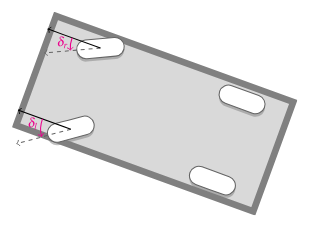
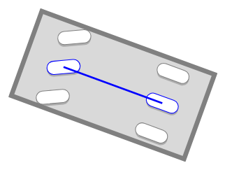
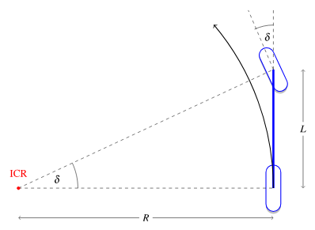
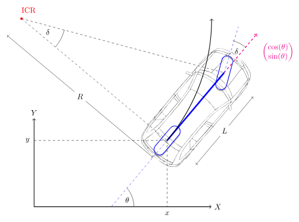
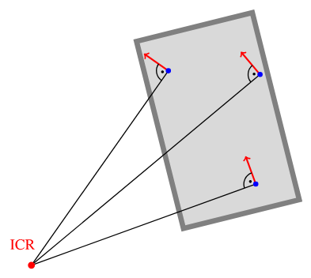

# Кинематическая велосипедная модель

> Геометрическая основа Pure Pursuit и части MPC. Рисунки — из [AAD](https://github.com/thomasfermi/Algorithms-for-Automated-Driving) (CC BY 4.0).

При **постоянном** угле переднего колеса $\delta$ задняя ось описывает в плоскости **дугу окружности**.
Поперечное управление — это выбор $\delta$ (а затем SWA на шине) так, чтобы эта дуга совпала с нужной вам дорогой.

## Угол колеса против SWA

| величина | смысл |
|---|---|
| $\delta$ | угол переднего колеса относительно кузова (модель) |
| SWA | угол рулевой колонки или рейки на CAN |

Связаны почти постоянным передаточным отношением и договорённостью о знаке:

$$
\mathrm{SWA} = \texttt{steer\_sign} \cdot \delta \cdot \texttt{steer\_ratio}.
$$

Числа для Golf MQB в `config.json`: $L \approx 2.636$ м, `steer_ratio ≈ 15.7`, `steer_sign = -1`.

```{admonition} Крошечный числовой пример
:class: tip
$\delta = +5°$ (колёса поворачиваются в «модельно-положительную» сторону).
Тогда $|\mathrm{SWA}| = 15.7 \times 5° = 78.5°$, а с `steer_sign = -1` команда на CAN — это $\mathrm{SWA} = -78.5°$.
Один градус на колесе — это примерно шестнадцать градусов на рулевом колесе; вот почему SWA в бегах выглядит «большим».
```

```python
import math

L = 2.636          # m, wheelbase
STEER_RATIO = 15.7
STEER_SIGN = -1

def swa_from_delta_deg(delta_deg: float) -> float:
    """Wheel angle [deg] → steering-wheel angle on CAN [deg]."""
    return STEER_SIGN * delta_deg * STEER_RATIO

print(swa_from_delta_deg(5.0))   # -78.5
print(swa_from_delta_deg(-5.0))  # +78.5
```



Левое и правое колёса поворачиваются на разные углы (Аккерман). Велосипедная модель заменяет переднюю ось **одним** эквивалентным $\delta$.

## Почему $\tan\delta = L/R$





Предположим качение **без поперечного скольжения**. Скорость заднего колеса направлена вдоль кузова, скорость переднего — вдоль повёрнутого колеса.
Мгновенное движение — это чистое вращение вокруг **МЦВ** (пересечения осей колёс).

Посмотрите на прямоугольный треугольник МЦВ–заднее–переднее:

* против угла $\delta$ лежит база $L$;
* прилежащий — радиус дуги $R$ задней оси.

Следовательно

$$
\tan\delta = \frac{L}{R}.
$$

Отсюда три равносильные формы, которые студент должен запомнить:

$$
\delta = \arctan\frac{L}{R},
\qquad
R = \frac{L}{\tan\delta},
\qquad
\kappa = \frac{1}{R} = \frac{\tan\delta}{L}.
$$

Здесь $\kappa$ — **кривизна пути** задней оси, 1/м. Прямая дорога: $\kappa = 0$ $\Rightarrow$ $\delta = 0$.

### Разобранный пример (руками)

Возьмём $L = 2.64$ м и $\delta = 5° = 5\pi/180 \approx 0.08727$ рад.

$$
\kappa = \frac{\tan(0.08727)}{2.64} \approx \frac{0.0875}{2.64} \approx 0.0331~\mathrm{m}^{-1},
\qquad
R = \frac{1}{\kappa} \approx 30.2~\mathrm{м}.
$$

То есть мягкие $5°$ на колёсах — это уже радиус около 30 м, территория городской дуги.

```python
import math

def kappa_from_delta(delta_rad: float, L: float = 2.64) -> float:
    return math.tan(delta_rad) / L

def delta_from_radius(R: float, L: float = 2.64) -> float:
    return math.atan(L / R)

delta = math.radians(5)
k = kappa_from_delta(delta)
R = 1.0 / k
print(f"kappa={k:.4f} 1/m,  R={R:.1f} m")

# Inverse check: radius 50 m → wheel angle
print(f"delta for R=50 m: {math.degrees(delta_from_radius(50)):.2f} deg")
```

## Состояние $(x, y, \theta)$

| обозначение | смысл |
|---|---|
| $x, y$ | положение задней оси в плоской мировой системе, м |
| $\theta$ | курс (рыск), рад |
| $v$ | продольная скорость, м/с |



Без скольжения кинематические уравнения такие:

$$
\dot x = v\cos\theta,
\qquad
\dot y = v\sin\theta,
\qquad
\dot\theta = \frac{v}{L}\tan\delta = v\,\kappa.
$$

```{admonition} Дискретный шаг (то, что делает симулятор)
:class: note
Для малого $\Delta t$:
$x \leftarrow x + v\cos\theta\,\Delta t$,
$y \leftarrow y + v\sin\theta\,\Delta t$,
$\theta \leftarrow \theta + v\tan\delta / L \cdot \Delta t$.
```

```python
import math

def bicycle_step(x, y, theta, v, delta, L=2.64, dt=0.05):
    """One Euler step of the kinematic bicycle [SI units]."""
    x = x + v * math.cos(theta) * dt
    y = y + v * math.sin(theta) * dt
    theta = theta + v * math.tan(delta) / L * dt
    return x, y, theta

# Drive 2 s at 10 m/s with +3° wheel angle — expect slow left/right turn
x = y = theta = 0.0
delta = math.radians(3)
for _ in range(40):  # 40 * 0.05 s = 2 s
    x, y, theta = bicycle_step(x, y, theta, v=10.0, delta=delta)
print(f"after 2 s: x={x:.2f} m, y={y:.2f} m, yaw={math.degrees(theta):.1f} deg")
```

## Мгновенный центр вращения (МЦВ)


Для плоского движения твёрдого тела всегда существует МЦВ, такой что

$$
\dot{\mathbf{r}} = \boldsymbol{\Omega}\times(\mathbf{r}-\mathbf{r}_{\mathrm{ICR}}).
$$




Отсутствие скольжения ⇒ скорость колеса перпендикулярна его оси. Проведите обе линии осей; они пересекаются в МЦВ. Рулевое управление по Аккерману — это ровно «сделать так, чтобы эти линии пересеклись в одной точке».

### Поперечное скольжение (предварительно)

При больших $v$ шины скользят боком. Настоящий МЦВ смещается, и

$$
\kappa_{\mathrm{fact}} = \frac{\dot\psi}{v} < \frac{\tan\delta}{L} = \kappa_{\mathrm{kin}}.
$$


На шоссе кинематика **завышает** кривизну — об этом следующая глава.

## Держится ли это на настоящей машине? Измерьте, прежде чем верить

Модель — страница геометрии без свободных параметров, что делает её и надёжной, и легко переоцениваемой.
Честный способ закончить главу — проверить её, и проверка доступна: на установившихся дугах можно сравнить
достигнутую машиной кривизну, $\dot\psi / v$ с датчика рыска ESP, с той $\tan\delta / L$, которую модель
предсказывает по углу руля.

```python
# Measured on this Golf, steady arcs, binned by speed. Model expectation from the bicycle model plus a
# textbook understeer gradient — the point is which column moves and how fast.
MEASURED = ((7.5, 0.97, 0.96), (13.5, 0.80, 0.87), (23.5, 0.54, 0.69))

print(f"{'speed':>8} {'achieved/predicted':>19} {'expected':>9} {'verdict'}")
for v, ratio, expected in MEASURED:
    gap = ratio - expected
    verdict = ("model is fine" if ratio > 0.95 else
               "usable with a correction" if ratio > 0.7 else
               "model over-commands by 2x")
    print(f"{v:>5.1f} m/s {ratio:>17.2f} {expected:>9.2f}   {verdict}")
```

Отсюда две вещи.

На парковочных и городских скоростях модель практически точна — потому все учебные выводы на этом и
останавливаются, и потому её правильно учить первой. На 23.5 м/с она даёт едва половину запрошенной кривизны.

И заметьте, что измеренное отношение **ниже книжного ожидания на каждой скорости** — 0.54 против 0.69 при
23.5 м/с. То есть скольжение не просто присутствует, оно сильнее, чем предсказывает стандартный градиент
недокрута. Этот зазор — не погрешность, которую можно впитать в коэффициент; это причина, по которой
существует [глава про модель машины](./VehicleModel.md), и причина, по которой в списке этого проекта стоит
обучаемый оценщик параметров, а не подобранная руками константа.

### Чего стоит недобор, в метрах

Абстрактным отношением легко пренебречь, поэтому переведём его. Если модель просит кривизну $\kappa$, а машина
выдаёт $r\kappa$, то она поворачивает по большему радиусу, чем задумано, и уходит **наружу** поворота. На дуге
длиной $s$ поперечный недобор примерно равен

$$
\Delta y \approx \tfrac{1}{2}(1 - r)\,\kappa\,s^2 .
$$

```python
def outward_drift(radius_m, ratio, arc_length_m):
    """Lateral error from delivering only `ratio` of the commanded curvature over an arc."""
    kappa = 1.0 / radius_m
    return 0.5 * (1.0 - ratio) * kappa * arc_length_m ** 2

# The arc episodes actually driven, with the measured ratio at their speed.
for radius, v, ratio, seconds in ((231.0, 13.6, 0.80, 21.7), (150.0, 13.8, 0.80, 12.2),
                                  (134.0, 11.8, 0.80, 14.8), (123.0, 13.8, 0.80, 10.4)):
    s_arc = v * seconds
    print(f"R {radius:>5.0f} m at {v:>4.1f} m/s for {seconds:>4.1f} s ({s_arc:>5.0f} m of arc): "
          f"open-loop drift {outward_drift(radius, ratio, s_arc):>6.1f} m")
print("\nThose are open-loop numbers — feedback removes most of them. What survives feedback is the\n"
      "0.21-0.29 m of steady tracking error measured on real left arcs, and that is the residue of\n"
      "exactly this effect.")
```

Числа абсурдны намеренно: десятки метров. Столько сделала бы одна геометрия на длинной дуге, и потому ни одна
система удержания полосы не работает в открытом контуре. Но это же показывает, почему упреждающая часть так
важна: обратная связь, которой приходится вычитать десятки метров ошибки модели, ничего не оставляет на дорогу.

## Итог

1. $\kappa = \tan\delta / L$, $R = 1/\kappa$.
2. $\mathrm{SWA} = \texttt{steer\_sign}\cdot\delta\cdot\texttt{steer\_ratio}$.
3. МЦВ объясняет геометрию; скольжение ломает допущение об отсутствии скольжения на скорости.
4. **Проверено об машину**: точно ниже 9 м/с, 0.80 при 12–15, 0.54 при 21–26 — и хуже книжного градиента
   недокрута на каждой скорости. Верьте модели там, где её проверяли, а не везде.

```{admonition} Задание
:class: tip
1. Для $L=2.64$ м, $R=50$ м: посчитайте $\delta$ в градусах и $|\mathrm{SWA}|$ при отношении $15.7$.
2. Измените цикл `bicycle_step` в примере: какой $y$ получится через 2 с, если $\delta=0$? (Должен остаться около нуля.)
3. Убедитесь по рисунку МЦВ, что нижний левый угол равен $\delta$.
```

<!-- next-chapter -->
---

**Дальше:** [Pure Pursuit](./PurePursuit.md)
