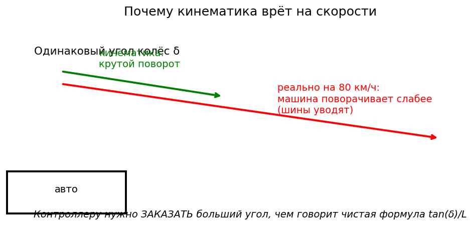

# Модель машины (недокрут)

## Кинематика против реальности

Из главы про велосипедную модель **кинематическая** кривизна при угле колеса $\delta$ равна

$$
\kappa_{\mathrm{kin}} = \frac{\tan\delta}{L}.
$$

Если бы машина ей действительно следовала, скорость рыска удовлетворяла бы $\dot\psi = v\,\kappa_{\mathrm{kin}}$.
Определим **измеренную** кривизну по датчикам:

$$
\kappa_{\mathrm{fact}} = \frac{\dot\psi}{v}.
$$

На парковочных скоростях $\kappa_{\mathrm{fact}} \approx \kappa_{\mathrm{kin}}$.
На шоссе шины скользят: при **том же** $\delta$ вы получаете **меньше** кривизны,

$$
\frac{\kappa_{\mathrm{fact}}}{\kappa_{\mathrm{kin}}} < 1.
$$



Если упреждающая часть использует только $\kappa_{\mathrm{kin}}$, она **недозаказывает** SWA на дугах → снос наружу; обратная связь вступает поздно, после задержки зрения.

## Простая формула недокрута

```{figure} figures/understeer_command.png
---
width: 75%
---
Чтобы держать тот же радиус, модель командует больший угол с ростом скорости — и сильнее при меньшем
факторе жёсткости.
```


Однопараметрическая модель, используемая в стеках вроде openpilot (и наш `tire_stiffness_factor`), выглядит так:

$$
\kappa_{\mathrm{fact}} \approx \frac{\kappa_{\mathrm{kin}}}{1 - c\, v^{2}}
\quad\text{с коэффициентом недокрута } c < 0 \text{ в обычной договорённости о скольжении,}
$$

или равносильно: чтобы **получить** желаемую $\kappa_{\mathrm{des}}$, нужно скомандовать угол колеса больше, чем $\arctan(L\kappa_{\mathrm{des}})$.

Операционально в коде:

$$
\delta_{\mathrm{kin}} = \arctan(L\,\kappa_{\mathrm{des}}),
\qquad
\delta_{\mathrm{cmd}} = f_{\mathrm{VM}}(\kappa_{\mathrm{des}}, v) > \delta_{\mathrm{kin}} \text{ при больших } v.
$$

```{admonition} Интуиция
:class: tip
Шины делают машину «длиннее» в пространстве кривизны: тот же $\delta$, меньшая $\kappa$.
Модель машины **масштабирует команду вверх**, чтобы умственный велосипед совпал с настоящим Golf.
```

## Сначала прочувствуйте оба дефекта на игрушке

Прежде чем измерять настоящую машину, испортите игрушечный объект теми двумя дефектами, о которых эта
глава: колёса больше не едут туда, куда смотрят, а команды приходят через 0.35 с. Три опорные точки
$G(v)$ — измерение этой машины (таблица ниже); задержка — `fp_steer_delay_s`:

```python
import math
from collections import deque
import numpy as np

DT, L = 0.05, 2.636
MAX_STEER = math.radians(25.0)

def G_of_v(v):
    """Achieved / kinematic curvature, measured on the Golf at 8, 13.5, 23.5 m/s."""
    return float(np.interp(v, [8.0, 13.5, 23.5], [0.97, 0.80, 0.54]))

def make_plant(v, delay_s=0.0):
    """Returns step(delta_cmd) -> (x, y, psi). The queue is the delay."""
    state = {"x": 0.0, "y": 0.0, "psi": 0.0}
    q = deque([0.0] * max(0, round(delay_s / DT)))
    def step(delta_cmd):
        q.append(float(np.clip(delta_cmd, -MAX_STEER, MAX_STEER)))
        delta = q.popleft()
        state["x"] += v * math.cos(state["psi"]) * DT
        state["y"] += v * math.sin(state["psi"]) * DT
        state["psi"] += v * G_of_v(v) * math.tan(delta) / L * DT
        return state["x"], state["y"], state["psi"]
    return step, q
```

**Дефект 1 — дуга, которая убегает.** Подайте упреждение на дугу R = 210 м на 23.5 м/с ровно так, как
велит велосипедная модель, и смотрите:

```python
KAPPA = 1.0 / 210.0
V = 23.5

def drift_on_arc(compensate, t_end=5.0):
    """Signed offset from the arc after t_end seconds (positive = outside)."""
    step, _ = make_plant(V)
    delta = math.atan(L * KAPPA / (G_of_v(V) if compensate else 1.0))
    for _ in range(int(t_end / DT)):
        x, y, psi = step(delta)
    return math.hypot(x, y - 1.0 / KAPPA) - 1.0 / KAPPA

raw = drift_on_arc(False)
fixed = drift_on_arc(True)
print(f"kinematic feed-forward: {raw:+.1f} m outside the arc after 5 s")
print(f"divided by G(v):        {fixed:+.2f} m   (open loop — the residue is Euler drift)")
assert raw > 5.0, "uncompensated understeer must leave the arc by metres"
assert abs(fixed) < 0.5, "acceptance: dividing the curvature by G(v) holds the arc"
```

Одно деление чинит всё — *если вы знаете $G$*. Остаток главы — про то, как его знать: из физической
модели, а не по таблице, потому что таблица с сухого асфальта неверна на мокром.

**Дефект 2 — задержка, превращающая хороший регулятор в осциллятор.** Прямая дорога, регулятор
«курс + смещение», державший 7 см на синусоиде, — и 0.35 с задержки:

```python
def drive_straight(delay_s, predict, kp=2.0, t_end=12.0, v=23.5):
    """Straight road, start 1 m off centre; returns (settled |CTE| p95, worst |CTE|)."""
    sx, sy, spsi = 0.0, 1.0, 0.0
    queue = deque([0.0] * max(0, round(delay_s / DT)))
    ctes = []
    for _ in range(int(t_end / DT)):
        ex, ey, epsi = sx, sy, spsi
        if predict:
            # dead-reckon through every command still in flight
            for d in queue:
                ex += v * math.cos(epsi) * DT
                ey += v * math.sin(epsi) * DT
                epsi += v * G_of_v(v) * math.tan(d) / L * DT
        delta_cmd = float(np.clip(-epsi - math.atan2(kp * ey, v), -MAX_STEER, MAX_STEER))
        queue.append(delta_cmd)
        d = queue.popleft()
        sx += v * math.cos(spsi) * DT
        sy += v * math.sin(spsi) * DT
        spsi += v * G_of_v(v) * math.tan(d) / L * DT
        ctes.append(abs(sy))
    ctes = np.array(ctes)
    return float(np.percentile(ctes[len(ctes) // 2:], 95)), float(ctes.max())

p95_no_delay, _ = drive_straight(0.0, predict=False)
p95_delayed, worst = drive_straight(0.35, predict=False)
p95_predicted, _ = drive_straight(0.35, predict=True)
print(f"no delay:            settled p95 {p95_no_delay:.3f} m")
print(f"0.35 s delay:        settled p95 {p95_delayed:.3f} m, worst {worst:.2f} m")
print(f"delay + prediction:  settled p95 {p95_predicted:.3f} m")
assert p95_no_delay < 0.05
assert p95_delayed > 1.0, "the same gains with 0.35 s of delay must oscillate out of the lane"
assert p95_predicted < 0.05, "acceptance: predicting through the in-flight commands restores the loop"
```

```{figure} figures/slip_delay.png
---
width: 95%
---
Слева: нескомпенсированный недокрут выносит из дуги; деление кривизны на G(v) держит её. Справа: 0.35 с
задержки раскачивают контур, а досчёт сквозь команды в полёте его возвращает.
```

Лекарство — не меньший коэффициент (попробуйте: раскачка уменьшится, и отклик умрёт с ней). Лекарство —
**управлять тем состоянием, которое команда встретит, а не тем, которое вы измерили**: досчитать через
каждую команду в полёте и только потом решать. Боевой `lagAdjustedCurvature` — ровно этот цикл в
пространстве кривизны ([MPC и fp](../Planner/MPC_and_FP.md), *fp-5*).

## Рецепт измерения (по бегу)

На кадрах, где рулит **водитель** (или при любом известном SWA):

1. $\delta = \mathrm{SWA} / (\mathrm{steer\_sign}\cdot\mathrm{steer\_ratio})$.
2. $\kappa_{\mathrm{kin}} = \tan\delta / L$.
3. $\kappa_{\mathrm{fact}} = \dot\psi / v$ (нужно, чтобы $v$ не была крошечной).
4. Разбить по диапазонам $v$, сообщить медианное отношение $\kappa_{\mathrm{fact}}/\kappa_{\mathrm{kin}}$.

Опорная таблица с нашего Golf:

| $v$, м/с | $\kappa_{\mathrm{fact}}/\kappa_{\mathrm{kin}}$ |
|---|---|
| 6–9 | 0.97 |
| 12–15 | 0.80 |
| 21–26 | 0.54 |

```python
import math
import numpy as np

L = 2.636
STEER_RATIO = 15.7
STEER_SIGN = -1

def delta_from_swa_deg(swa_deg: float) -> float:
    return math.radians(swa_deg / (STEER_SIGN * STEER_RATIO))

def ratio_kin_vs_fact(swa_deg, yaw_rate_rad_s, v_mps):
    """Return kappa_fact / kappa_kin (NaN if unstable)."""
    if abs(v_mps) < 1.0:
        return float("nan")
    delta = delta_from_swa_deg(swa_deg)
    k_kin = math.tan(delta) / L
    k_fact = yaw_rate_rad_s / v_mps
    if abs(k_kin) < 1e-6:
        return float("nan")
    return k_fact / k_kin

# At 22 m/s the measured ratio on this car is 0.54 — not a guess, see the table below.
v = 22.0
swa = -60.0  # deg on CAN
delta = delta_from_swa_deg(swa)
k_kin = math.tan(delta) / L
k_fact = 0.54 * k_kin
yaw = k_fact * v
print(f"delta={math.degrees(delta):.2f} deg, k_kin={k_kin:.4f}, "
      f"ratio={ratio_kin_vs_fact(swa, yaw, v):.2f}")
```

Сколько дополнительного SWA нужно упреждающей части? Чтобы вернуть ту $\kappa_{\mathrm{fact}}$, которую
кинематика обещала на малой скорости, при 22 м/с пришлось бы масштабировать на $1/0.54 \approx 1.85$. Держите
это число нежёстко: столько просит *наивное* обращение, а настоящая модель машины распределяет поправку по
скорости плавно, а не применяет один множитель. Разрыв между 1.85 и теми 3–9 %, на которые поставляемый
параметр реально меняет команду, — предмет остальной части главы.

```python
k_des = 0.02  # 1/m, mild arc
delta_kin = math.atan(L * k_des)
# crude high-speed correction: inflate the kappa request by the measured shortfall
delta_vm = math.atan(L * k_des / 0.54)
print(f"|SWA| kin={abs(math.degrees(delta_kin)*STEER_RATIO):.1f} deg, "
      f"VM~{abs(math.degrees(delta_vm)*STEER_RATIO):.1f} deg")
```

## Ручки проекта

* C++ `vehicle_model.h`, Python `scripts/core/vehicle_model.py`
* `vehicle.lat_use_vehicle_model = true`
* `tire_stiffness_factor` — **поставляется 0.64** (дефолт в коде, оверрайда в конфиге нет); остальная часть главы
  потому что путь к нему полезнее самого значения.

## Калибровка одного коэффициента и обнаружение, что одним он быть не может

Здесь курс обычно останавливается: есть формула с одним свободным параметром, вы измеряете отношение по бегу,
решаете уравнение относительно параметра. Мы так и сделали. Получилось противоречие, на разрешение которого
ушло два заезда и третий датчик, и само противоречие — это и есть урок.

### Противоречие

Два независимых источника расходились в *направлении* поправки:

| источник | утверждает | что следует |
|---|---|---|
| наш замер по бегу | $\kappa_{\text{fact}}/\kappa_{\text{kin}} = 0.54$ при 22 м/с | недокрут **сильнее**, чем предполагают наши поставляемые 0.64 → понижать коэффициент |
| `liveParameters` коммы, выучено на **этой же машине** | `tireStiffnessFactor` = 1.319 ± 0.007 | недокрут **слабее** → повышать, причём вдвое |

Оба быть правы не могут, и отбросить нельзя ни один: их оценщик работал часами на наших дорогах с крошечным
разбросом, а наш замер был прямой арифметикой по нашим же логам.

### Как это разрешилось: найти третий датчик

Под подозрение попал вход, общий для обоих расчётов и не проверяемый ни одним из них, — скорость рыска. Наша
приходит с датчика ESP машины по CAN. Если бы он был отмасштабирован, наши 0.54 были бы неверны ровно на этот
масштаб, и спор кончился бы.

Значит: сравнить его с двумя другими вещами, измеряющими ту же физическую величину.

```python
# Three sensors, one quantity. Ratios measured on run 2026_08_04_21_00_18.
PAIRS = {"phone gyro / ESP": 1.017, "camera odometry / ESP": 0.849, "camera odometry / gyro": 0.788}
for name, ratio in PAIRS.items():
    print(f"{name:>24}: {ratio:.3f}")

print("\nTwo physically independent sensors — a MEMS gyro and a wheel-based ESP unit — agree to 1.7 %,")
print("with no dependence on speed. The camera is the outlier against both, consistently, and by")
print("roughly the amount its own metric scale is off (0.888). So the ESP yaw rate is sound, and the")
print("0.54 measurement stands.")
```

Это закрыло вопрос единственным способом, каким его можно было закрыть: не спором о том, чей оценщик лучше, а
добавлением измерения, которое делает один из них проверяемым. Пока это не было сделано,
`tire_stiffness_factor` был заморожен — намеренно, потому что двигать коэффициент, пока его собственный вход
под подозрением, значит получить число, подходящее одному заезду и ничему больше.

### Что правка дала на самом деле

С проверенным входом коэффициент сдвинулся с 0.64 до 0.50, и следующий заезд был измерен на той же дороге:

| | до (0.64) | после (0.50) |
|---|---|---|
| левая дуга, итоговое смещение | +0.30 м | **+0.23 м** |
| левая дуга, ошибка слежения | +0.29 м | **+0.21 м** |

```python
def understeer_command(kappa, v_ms, stiffness_factor, L=2.636, ratio=15.7):
    """Feedforward with the understeer term, in steering-wheel degrees."""
    K = 0.0015 / max(stiffness_factor, 1e-3)
    return math.degrees(math.atan(kappa * L) * (1.0 + K * v_ms * v_ms)) * ratio

print(f"{'radius':>8} {'speed':>7} {'tsf 0.64':>10} {'tsf 0.50':>10} {'change':>8}")
for radius, v in ((231.0, 13.6), (150.0, 13.8), (134.0, 11.8), (123.0, 13.8)):
    a = understeer_command(1.0 / radius, v, 0.64)
    b = understeer_command(1.0 / radius, v, 0.50)
    print(f"{radius:>6.0f} m {v:>5.1f} m/s {a:>9.1f}° {b:>9.1f}° {100 * (b / a - 1):>+7.1f}%")
```

Обратите внимание на величину: **на 3–9 % больше угла руля**. Подстройка, а не рычаг — и она убрала четверть
ошибки слежения. Это хорошее отношение эффекта к вмешательству, и одновременно тревожный признак: если 3 %
изменения команды двигают результат на 25 %, контур работает у предела.

### Почему это не может закончиться константой

Заканчивается здесь потому, что само отношение непостоянно:

| скорость | измеренное отношение |
|---|---|
| 6–9 м/с | 0.97 |
| 12–15 м/с | 0.80 |
| 21–26 м/с | 0.54 |

Один `tire_stiffness_factor` подходит одной строке. Выберите его для города — шоссе недозаказывает; выберите
для шоссе — городские дуги срезаются. И 0.50 измеренно верен на городских дугах, но **в реплее** городскую
дугу ухудшил (−0.44 → −0.52 м), а такое расхождение получается, когда один параметр тащит две работы.

Структурный ответ — перестать подгонять константу и оценивать параметры непрерывно, с зависимостью от $v^2$ в
модели наблюдения, а не запечённой в число. Именно это делает `paramsd` у upstream — фильтр из девяти
состояний по жёсткости, передаточному отношению, двум смещениям руля и уклону дороги. В этом проекте порт
**существует, измерен и поставляется отключённым**: [Локализация](../Localization/Overview.md), шаг 6 —
это измерение того, почему. Крен дороги (поперечный уклон даёт ту же поперечную подпись, что и
недокручивающая машина) теперь оценивается (шаг 5), но остаётся вырождение жёсткость↔передаточное, которое
данные не разделяют, — оно и держит фичу выключенной.

## Задержка конвейера и почему компенсация больше измерения

Второе, что должна знать упреждающая часть, — что её картина дороги устарела. Медианы, измеренные на ночном
заезде длиной 28 минут:

| звено | мс | как измерено |
|---|---:|---|
| съёмка → выход модели | 54 | `infer_ts − capture_ts` в `vision/lanes` |
| выход модели → команда на руль | 21 | до публикации `controls/steer` |
| передача CAN пандой | ~10 | свой таймер 10 мс, не помечается |
| **до провода** | **~89** | |
| команда → угол рейки | ~40 | отклик EPS, по CAN |
| рейка → скорость рыска | ~120 | динамика машины |
| **до скорости рыска** | **~250** | |

`fp_steer_delay_s = 0.35` намеренно больше любой из этих сумм, и причину стоит проговорить, потому что выглядит
это как небрежность. Первые три строки — *транспорт*, чистое запаздывание, и упреждение компенсирует их точно.
Последние две — *динамика*: отклик примерно первого порядка, и компенсация его номинальной постоянной не
оставляет запаса на то, что отклик окажется медленнее номинала на холодной рейке, изношенной шине или неровной
поверхности. Недокомпенсация сносит, перекомпенсация раскачивает, и контур переносит первое куда легче второго.

```python
V = 22.0
print(f"{'delay':>8} {'travel at 22 m/s':>18} {'what it covers'}")
for delay, what in ((0.089, "to the wire"), (0.25, "to yaw rate"), (0.35, "shipped lookahead")):
    print(f"{delay:>7.3f}s {V * delay:>15.2f} m   {what}")
print()
print("The car covers 7.7 m during the shipped lookahead. On a 130 m arc that is 3.4 deg of")
print("heading, which is why the lookahead is a feedforward input and not a tuning nicety.")
```

```{admonition} Диагностика сноса на дуге
:class: warning
Порядок: (1) модель машины включена; (2) темп зрения и сквозная задержка в норме; (3) и только потом веса CTE и epsi.
```

## Задания

1. Запустите синтетический пример `ratio_kin_vs_fact`; замените `0.54` на `0.99` и посмотрите, как исчезает раздувание SWA.
2. По бегу с рулением водителя постройте отношение по диапазонам $v$; сравните с таблицей.
3. Объясните одним предложением, почему срезание `fp_steer_delay_s` до $0.23$ всё равно может ухудшить замкнутый контур.

<!-- next-chapter -->
---

**Дальше:** [Угловой контур](./AngleControl.md)
