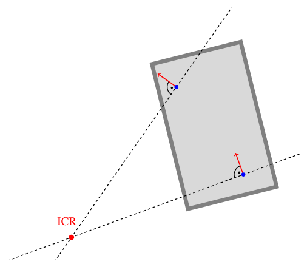
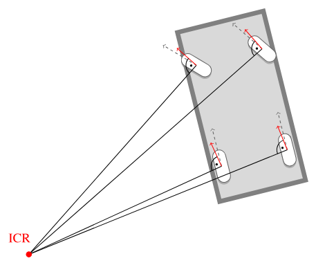

# Кинематическая велосипедная модель

> Геометрическая основа Pure Pursuit и части MPC. Рисунки — из [AAD](https://github.com/thomasfermi/Algorithms-for-Automated-Driving) (CC BY 4.0).

При **постоянном** угле переднего колеса $\delta$ задняя ось вычерчивает на плоскости **дугу окружности**.
Поперечное управление и сводится к выбору $\delta$ (а затем SWA на шине) так, чтобы эта дуга легла на нужную дорогу.

## Угол колеса против SWA

| величина | смысл |
|---|---|
| $\delta$ | угол переднего колеса относительно кузова (модель) |
| SWA | угол рулевой колонки или рейки на CAN |

Связаны почти постоянным передаточным отношением и договорённостью о знаке:

$$
\mathrm{SWA} = \mathrm{steer\_sign} \cdot \delta \cdot \mathrm{steer\_ratio}.
$$

Числа для Golf MQB берутся из `config.json`: $L \approx 2.636$ м, `steer_ratio ≈ 15.7`, `steer_sign = -1`. В примерах, которые считаются вручную, $L$ для наглядности округлён до 2.64 м; в исполняемых блоках управления стоит точное 2.636.

```{admonition} Крошечный числовой пример
:class: tip
$\delta = +5°$ (колёса поворачиваются в «модельно-положительную» сторону).
Тогда $|\mathrm{SWA}| = 15.7 \times 5° = 78.5°$, а с `steer_sign = -1` команда на CAN равна $\mathrm{SWA} = -78.5°$.
Один градус на колесе — это около шестнадцати градусов на рулевом колесе; вот почему SWA в бегах кажется «большим».
```

```python
import math

L = 2.636          # m, wheelbase
STEER_RATIO = 15.7
STEER_SIGN = -1

def swa_from_delta_deg(delta_deg: float) -> float:
    """Wheel angle [deg] → steering-wheel angle on CAN [deg]."""
    return STEER_SIGN * delta_deg * STEER_RATIO

print(swa_from_delta_deg(5.0))   # -78.5
print(swa_from_delta_deg(-5.0))  # +78.5
```


Левое и правое колёса поворачиваются на разные углы (Аккерман). Велосипедная модель сводит переднюю ось к **одному** эквивалентному $\delta$.

## Почему $\tan\delta = L/R$


Пусть качение идёт **без поперечного скольжения**. Тогда скорость заднего колеса направлена вдоль кузова, а скорость переднего — вдоль повёрнутого колеса.
Мгновенное движение — это чистое вращение вокруг **МЦВ** (точки пересечения осей колёс).

Рассмотрим прямоугольный треугольник МЦВ–заднее–переднее:

* напротив угла $\delta$ лежит база $L$;
* прилежащий к нему катет — радиус дуги $R$ задней оси.

Отсюда

$$
\tan\delta = \frac{L}{R}.
$$

Отсюда три равносильные формы — их стоит запомнить:

$$
\delta = \arctan\frac{L}{R},
\qquad
R = \frac{L}{\tan\delta},
\qquad
\kappa = \frac{1}{R} = \frac{\tan\delta}{L}.
$$

Здесь $\kappa$ — **кривизна пути** задней оси, 1/м. На прямой дороге $\kappa = 0$, а значит, $\delta = 0$.

### Разбор примера (вручную)

Возьмём $L = 2.64$ м и $\delta = 5° = 5\pi/180 \approx 0.08727$ рад.

$$
\kappa = \frac{\tan(0.08727)}{2.64} \approx \frac{0.0875}{2.64} \approx 0.0331~\mathrm{m}^{-1},
\qquad
R = \frac{1}{\kappa} \approx 30.2~\mathrm{м}.
$$

То есть скромные $5°$ на колёсах — это уже радиус около 30 м, типичная городская дуга.

```python
import math

def kappa_from_delta(delta_rad: float, L: float = 2.64) -> float:
    return math.tan(delta_rad) / L

def delta_from_radius(R: float, L: float = 2.64) -> float:
    return math.atan(L / R)

delta = math.radians(5)
k = kappa_from_delta(delta)
R = 1.0 / k
print(f"kappa={k:.4f} 1/m,  R={R:.1f} m")

# Inverse check: radius 50 m → wheel angle
print(f"delta for R=50 m: {math.degrees(delta_from_radius(50)):.2f} deg")
```

## Состояние $(x, y, \theta)$

| обозначение | смысл |
|---|---|
| $x, y$ | положение задней оси в плоской мировой системе, м |
| $\theta$ | курс (рыск), рад |
| $v$ | продольная скорость, м/с |


Без скольжения кинематические уравнения выглядят так:

$$
\dot x = v\cos\theta,
\qquad
\dot y = v\sin\theta,
\qquad
\dot\theta = \frac{v}{L}\tan\delta = v\,\kappa.
$$

```{admonition} Дискретный шаг (то, что делает симулятор)
:class: note
Для малого $\Delta t$:
$x \leftarrow x + v\cos\theta\,\Delta t$,
$y \leftarrow y + v\sin\theta\,\Delta t$,
$\theta \leftarrow \theta + v\tan\delta / L \cdot \Delta t$.
```

```python
import math

def bicycle_step(x, y, theta, v, delta, L=2.64, dt=0.05):
    """One Euler step of the kinematic bicycle [SI units]."""
    x = x + v * math.cos(theta) * dt
    y = y + v * math.sin(theta) * dt
    theta = theta + v * math.tan(delta) / L * dt
    return x, y, theta

# Drive 2 s at 10 m/s with +3° wheel angle — expect slow left/right turn
x = y = theta = 0.0
delta = math.radians(3)
for _ in range(40):  # 40 * 0.05 s = 2 s
    x, y, theta = bicycle_step(x, y, theta, v=10.0, delta=delta)
print(f"after 2 s: x={x:.2f} m, y={y:.2f} m, yaw={math.degrees(theta):.1f} deg")
```

## Мгновенный центр вращения (МЦВ)


У плоского движения твёрдого тела всегда есть МЦВ — точка, для которой

$$
\dot{\mathbf{r}} = \boldsymbol{\Omega}\times(\mathbf{r}-\mathbf{r}_{\mathrm{ICR}}).
$$




Раз скольжения нет, скорость колеса перпендикулярна его оси. Проведите обе линии осей — они пересекутся в МЦВ. Рулевое управление по Аккерману как раз и означает «свести эти линии в одну точку».

### Поперечное скольжение (предварительно)

На больших $v$ шины уводит вбок. Настоящий МЦВ смещается, и

$$
\kappa_{\mathrm{fact}} = \frac{\dot\psi}{v} < \frac{\tan\delta}{L} = \kappa_{\mathrm{kin}}.
$$



На шоссе кинематика **завышает** кривизну — этому и посвящена следующая глава.

## Порулите ей сами — и увидите, как проваливается очевидный регулятор

Теперь модель — это объект, которым можно ехать. Дайте ей дорогу и самый очевидный регулятор на свете —
рулить против смещения, — и глава сама подведёт к следующей. Ниже только numpy:

```python
import math
import numpy as np

DT = 0.05     # control tick [s] — 20 Hz, the HCA frame rate on the real car
L = 2.636     # wheelbase [m] — the Golf's, straight from config.json
V = 10.0      # speed [m/s], constant in this tier

def step(x, y, psi, delta, v=V, dt=DT):
    """One tick of the kinematic bicycle."""
    x += v * math.cos(psi) * dt
    y += v * math.sin(psi) * dt
    psi += v * math.tan(delta) / L * dt
    return x, y, psi
```

Дорога — синусоида: пиковая кривизна $A(2\pi/\lambda)^2 \approx 0.0048$ 1/м, то есть радиус около 210 м —
класс «пологая дуга» из `docs/CONTROLLER_LIMITS.md`:

```python
A, LAM = 1.75, 120.0

def y_ref(x):
    return A * math.sin(2 * math.pi * x / LAM)

def psi_ref(x):
    return math.atan(A * 2 * math.pi / LAM * math.cos(2 * math.pi * x / LAM))
```

Сместились влево — руль вправо, пропорционально. Один коэффициент, одна строка:

```python
MAX_STEER = math.radians(25.0)   # the same ceiling the phone enforces

def p_controller(cte, kp=0.10):
    return float(np.clip(-kp * cte, -MAX_STEER, MAX_STEER))

def simulate(controller, t_end=60.0):
    """Drive the sine; return arrays of time and cross-track error."""
    x, y, psi = 0.0, 1.0, 0.0          # start 1 m off the road
    ts, ctes = [], []
    for k in range(int(t_end / DT)):
        cte = y - y_ref(x)
        delta = controller(x, y, psi, cte)
        x, y, psi = step(x, y, psi, delta)
        ts.append(k * DT)
        ctes.append(cte)
    return np.array(ts), np.array(ctes)

t, cte_p = simulate(lambda x, y, psi, cte: p_controller(cte))
first = np.max(np.abs(cte_p[t < 10]))
last = np.max(np.abs(cte_p[t > 50]))
crossings = int(np.sum(np.diff(np.sign(cte_p)) != 0))
print(f"P only: |CTE| max first 10 s {first:.2f} m, last 10 s {last:.2f} m, "
      f"{crossings} zero crossings in 60 s")
```

Постройте график `cte_p` от `t` и посмотрите: машина пересекает дорогу снова и снова, а **размах не
спадает**. Это не вопрос настройки. Руль задаёт *кривизну* траектории, кривизна интегрируется в курс,
курс — в смещение, поэтому P-по-смещению — это пружина без демпфера, незатухающий осциллятор. Любой
`kp` меняет частоту, но ни один не добавляет затухания. (Прямой Эйлер вдобавок подкачивает энергию, и
размах медленно растёт.)

Затухание даёт то состояние, которое вы не учли, — курс. Это **контроллер Stanley**: рулить так, чтобы
гасить ошибку курса $\psi_{\text{ref}}-\psi$ (угол носа относительно дороги), плюс член, который подаёт
смещение как *угол*. Член смещения — $\arctan(k\,\text{CTE}/v)$: это угол, потому что команда руля и есть
угол, а деление на $v$ нужно, чтобы то же смещение на скорости просило более мягкой поправки (резкий рывок
на 100 км/ч — это авария). Курс и есть то затухание, которого недоставало пружине по смещению:

```python
def heading_controller(x, y, psi, cte, kp=2.0):
    # Stanley: cancel heading error, and steer the offset in as a speed-scaled angle.
    err = (psi_ref(x) - psi) - math.atan2(kp * cte, V)
    return float(np.clip(err, -MAX_STEER, MAX_STEER))

t, cte_h = simulate(heading_controller)
settled = np.abs(cte_h[t > 20])
print(f"heading+offset: |CTE| p95 after settling {np.percentile(settled, 95):.3f} m, "
      f"max {settled.max():.3f} m")
assert np.percentile(settled, 95) < 0.15, "acceptance: the car must hold the sine within 15 cm"
assert last > 0.8 * first, "P-only must NOT settle — that is the lesson"
print("acceptance passed: damped follower holds the gentle road within 15 cm")
```

```{figure} figures/toycar_control.png
---
width: 85%
---
Один объект под двумя регуляторами: P-по-смещению качается без затухания; курс + смещение выводит на устойчивый режим.
```

Из этого эксперимента стоит вынести два факта: рабочий регулятор держит синусоиду в пределах 15 см — но
у него два подобранных вручную коэффициента, чьи верные значения зависят от скорости и дороги.
Регулятор, у которого руль *выводится* из геометрии пути и для номинального случая не нужны никакие
коэффициенты, — это [следующая глава](./PurePursuit.md). А внутренний контур настоящего стека устроен
ровно по форме «курс + смещение»: угловой PID вокруг рейки.

## Держится ли это на настоящей машине? Измерьте, прежде чем верить

Модель умещается на одну страницу геометрии и не имеет свободных параметров — оттого она и надёжна, и
слишком легко переоценивается. Честно закончить главу — значит проверить её, а проверка под рукой: на
установившихся дугах сравним достигнутую машиной кривизну $\dot\psi / v$ (с датчика рыска ESP) с той
$\tan\delta / L$, которую модель предсказывает по углу руля.

```python
# Measured on this Golf, steady arcs, binned by speed. Model expectation from the bicycle model plus a
# textbook understeer gradient — the point is which column moves and how fast.
MEASURED = ((7.5, 0.97, 0.96), (13.5, 0.80, 0.87), (23.5, 0.54, 0.69))

print(f"{'speed':>8} {'achieved/predicted':>19} {'expected':>9} {'verdict'}")
for v, ratio, expected in MEASURED:
    gap = ratio - expected
    verdict = ("model is fine" if ratio > 0.95 else
               "usable with a correction" if ratio > 0.7 else
               "model over-commands by 2x")
    print(f"{v:>5.1f} m/s {ratio:>17.2f} {expected:>9.2f}   {verdict}")
```

Отсюда два вывода.

На парковочных и городских скоростях модель почти точна — потому большинство учебников на этом и
останавливается, и потому её правильно изучать первой. А на 23.5 м/с она даёт едва половину запрошенной кривизны.

И обратите внимание: измеренное отношение **ниже книжного ожидания на каждой скорости** — 0.54 против 0.69
при 23.5 м/с. Значит, скольжение не просто есть, оно сильнее, чем предсказывает стандартный градиент
недокрута. Этот зазор — не погрешность, которую можно спрятать в коэффициент; это и есть причина, по
которой существует [глава про модель машины](../Control/VehicleModel.md), и причина, по которой в планах
проекта стоит обучаемый оценщик параметров, а не подобранная вручную константа.

### Чего стоит недобор, в метрах

```{figure} figures/understeer_drift.png
---
width: 70%
---
В разомкнутом контуре нескомпенсированный недобор выносит машину наружу пропорционально квадрату длины дуги.
```


Абстрактное отношение легко пропустить мимо ушей, поэтому переведём его в метры. Если модель просит кривизну
$\kappa$, а машина выдаёт $r\kappa$, то она идёт по большему радиусу, чем задумано, и уходит **наружу**
поворота. На дуге длиной $s$ поперечный недобор примерно равен

$$
\Delta y \approx \tfrac{1}{2}(1 - r)\,\kappa\,s^2 .
$$

```python
def outward_drift(radius_m, ratio, arc_length_m):
    """Lateral error from delivering only `ratio` of the commanded curvature over an arc."""
    kappa = 1.0 / radius_m
    return 0.5 * (1.0 - ratio) * kappa * arc_length_m ** 2

# The arc episodes actually driven, with the measured ratio at their speed.
for radius, v, ratio, seconds in ((231.0, 13.6, 0.80, 21.7), (150.0, 13.8, 0.80, 12.2),
                                  (134.0, 11.8, 0.80, 14.8), (123.0, 13.8, 0.80, 10.4)):
    s_arc = v * seconds
    print(f"R {radius:>5.0f} m at {v:>4.1f} m/s for {seconds:>4.1f} s ({s_arc:>5.0f} m of arc): "
          f"open-loop drift {outward_drift(radius, ratio, s_arc):>6.1f} m")
print("\nThose are open-loop numbers — feedback removes most of them. What survives feedback is the\n"
      "0.21-0.29 m of steady tracking error measured on real left arcs, and that is the residue of\n"
      "exactly this effect.")
```

Числа намеренно абсурдны — десятки метров. Столько на длинной дуге натворила бы одна геометрия, и потому ни
одна система удержания полосы не работает в открытом контуре. Но эти же числа показывают, чем так важна
упреждающая часть: если обратной связи приходится вычитать десятки метров ошибки модели, на саму дорогу у
неё ничего не остаётся.

## Итог

1. $\kappa = \tan\delta / L$, $R = 1/\kappa$.
2. $\mathrm{SWA} = \mathrm{steer\_sign}\cdot\delta\cdot\mathrm{steer\_ratio}$.
3. МЦВ объясняет геометрию; на скорости скольжение нарушает допущение об отсутствии скольжения.
4. **Проверено об машину**: точно ниже 9 м/с, 0.80 при 12–15, 0.54 при 21–26 — и на каждой скорости хуже
   книжного градиента недокрута. Верьте модели там, где её проверяли, а не везде подряд.

```{admonition} Задание
:class: tip
1. Для $L=2.64$ м, $R=50$ м посчитайте $\delta$ в градусах и $|\mathrm{SWA}|$ при отношении $15.7$.
2. Измените цикл `bicycle_step` в примере: какой $y$ выйдет через 2 с при $\delta=0$? (Должен остаться около нуля.)
3. Проверьте по рисунку МЦВ, что нижний левый угол равен $\delta$.
```

<!-- next-chapter -->
---

**Дальше:** [Pure Pursuit](./PurePursuit.md)
